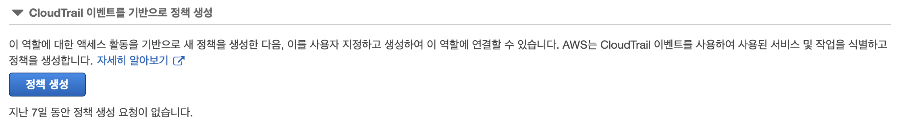

# 1.1 개발자 접근을 위한 IAM 역할 생성과 수임.
assume-role-policy-template.json 파일 생성
``` json
{
    "Version": "2012-10-17",
    "Statement": [
        {
            "Effect": "Allow",
            "Principal": {
                "AWS": "PRINCIPAL_ARN"
            },
            "Action": "sts:AssumeRole"
        }
    ]
}
```
그 다음 나의 ARN을 환경 변수로 설정</br>
`PRINCIPAL_ARN=$(aws sts get-caller-identity --query Arn --output text)`<br>
sed 명령어를 이용해서 미리 만들었던 파일의 principal_arn을 치환<br>
`sed -e "s|PRINCIPAL_ARN|${PRINCIPAL_ARN}|g" assume-role-policy-template.json > assume-role-policy.json`<br>
정책을 정의한 파일을 이용해 역할 생성 <br>
`ROLE_ARN=$(aws iam create-role --role-name awsrole101 --assume-role-policy-document file://assume-role-policy.json --output text --query Role.Arn)`<br>
aws관리형 정책인 PowerUserAccess 정책을 해당 역할에 연결<br>
`aws iam attach-role-policy --role-name awsrole101 --policy-arn arn:aws:iam::aws:policy/PowerUserAccess`<br>
아래 명령을 통해 확인
`aws sts assume-role --role-arn $ROLE_ARN --role-session-name awsrole101`<br>

# 1.2 액세스 패턴을 기반으로 최소 권한 IAM 정책 생성

cloudTrail을 이용할 경우 aws 모드 리전에서 활동에 대해 로깅할 수 있음. IAM 역할에 대한 정책을 생성할 때 항상 최소 권한의 원칙을 따라서 설정해야함. 또한, aws 계정을 사용하는 경우 일정 시간 후에 만료되는 시간 기반 토큰을 이용해야함. 1.2장은 CloudTrail 이벤트를 기반으로 간단한 정책을 생성하는 과정.

# 1.3 AWS 계정의 IAM 사용자 암호 정책 시행
보안을 위해서 aws 계정 내의 모든 사용자에 대해 암호 정책을 시행해야함. 암호는 90일의 유효기간이 있으면 대소문자 및 숫자, 기호를 포함해 최소 32자로 구성. 시작하기 앞서 IAM을 이용해서 사용자를 만들고 사용자에 대해서 IAMFullAccess, SecretsManagerReadWrite 정책을 설정했음.(.aws폴더에 credentials에 저장)
``` shell
# awscli를 이용해서 IAM 암호 정책 설정
aws iam update-account-password-policy --minimum-password-length 32 --require-symbols --require-numbers --require-uppercase-characters --require-lowercase-characters --allow-users-to-change-password --max-password-age 90 --password-reuse-prevention 1

#IAM 그룹 생성
aws iam create-group --group-name aws103group

#그룹에 awsbillingReadonlyaccess 정책 연결
aws iam attach-group-policy --group-name aws103group --policy-arn arn:aws:iam::aws:policy/AWSBillingReadOnlyAccess

#IAM 사용자 생성
aws iam create-user --user-name aws103user

# secrets manager를 사용해 정책에 해당하는 암호 생성
RANDOM_STRING=$(aws secretsmanager get-random-password --password-length 32 --require-each-included-type --output text --query RandomPassword)

# 생성한 암호로 로그인 프로필 생성
aws iam create-login-profile --user-name aws103user --password $RANDOM_STRING

# 정책이 연결된 group에 사용자 추가
aws iam add-user-to-group --group-name aws103group --user-name aws103user

# 정책 확인
aws iam get-account-password-policy
```

# 1.4 IAM 정책 시뮬레이터를 사용해서 IAM 정책 테스트
이번 챕터는 영향 범위를 확인하는 챕터.
```json
{
    "Version": "2012-10-17",
    "Statement": [
        {
            "Effect": "Allow",
            "Principal": {
                "Service": "ec2.amazonaws.com"
            },
            "Action": "sts:AssumeRole"
        }
    ]
}
```
``` shell
# 해당 파일을 이용해 새로운 IAM 역할 생성
aws iam create-role --assume-role-policy-document file://assume-role-policy.json --role-name aws104role

#IAM역할에 ec2ReadOnlyAccess 정책 연결
aws iam attach-role-policy --role-name aws104role --policy-arn arn:aws:iam::aws:policy/AmazonEC2ReadOnlyAccess

# simulate를 이용한 정책 시뮬레이션($AWS_ACCOUNT_ID가 잘안먹어서 id를 직접 대입했음)
# 해당 명령 결과 deny 됐다는것을 확인할 수 있음.
aws iam simulate-principal-policy --policy-source-arn arn:aws:iam::$AWS_ACCOUNT_ID:role/aws104role --action-names ec2:CreateInternetGateway

# instance를 read하는 작업 수행
aws iam simulate-principal-policy --policy-source-arn arn:aws:iam::$AWS_ACCOUNT_ID:role/aws104role --action-names ec2:DescribeInstances
```
IAM 정책 시뮬레이터를 사용하면 다음을 확인 가능
- id 기반 정책
- iam 권한 경계
- aws organizations 서비스 제어 정책
- 리소스 기반 정책

# 1.5 권한 경계를 사용한 IAM 관리 기능 위임
이번 챕터는 람다 함수가 사용할 수 있는 IAM 권한을 부여하는 챕터. 권한 경계 정책을 생성한 뒤 람다 개발자를 위한 IAM 역할을 생성. 그 후 경계 정책을 지정하는 IAM 정책을 생성하고, 생성한 역할에 정책을 연결.
``` shell
# 이전의 assign-role-policy 파일을 통해 역할생성
PRINCIPAL_ARN=$(aws sts get-caller-identity --query Arn --output text)

sed -e "s|PRINCIPAL_ARN|${PRINCIPAL_ARN}|g" assume-role-policy-template.json > assume-role-policy.json

ROLE_ARN=$(aws iam create-role --role-name aws105role --assume-role-policy-document file://assume-role-policy.json --output text --query Role.Arn)

# boundary 파일을 이용해서 권한 경계 지정
sed -e "s|AWS_ACCOUNT_ID|${AWS_ACCOUNT_ID}|g" boundary-policy-template.json > boundary-policy.json

# 권한 경계 정책 생성
aws iam create-policy --policy-name aws105pb --policy-document file://boundary-policy.json

# policy 파일을 이용해서 개발자를 위한 정책 생성
sed -e "s|AWS_ACCOUNT_ID|${AWS_ACCOUNT_ID}|g" policy-template.json > policy.json

aws iam create-policy --policy-name aws105policy --policy-document file://policy.json

# 정책 연결
aws iam attach-role-policy --role-name aws105role --policy-arn arn:aws:iam::$AWS_ACCOUNT_ID:policy/aws105policy

# 정책이 지정하는 명명표준(aws10*)을 준수하는 이름으로 권한 경계를 지정해 역할 생성 및 정책 연결
TEST_ROLE_1=$(aws iam create-role --role-name aws105test1 --assume-role-policy-document file://lambda-assume-role-policy.json --permissions-boundary arn:aws:iam::$AWS_ACCOUNT_ID:policy/aws105pb --output text --query Role.Arn)

aws iam attach-role-policy --role-name aws105test1 --policy-arn arn:aws:iam::aws:policy/AmazonDynamoDBFullAccess

aws iam attach-role-policy --role-name aws105test1 --policy-arn arn:aws:iam::aws:policy/CloudWatchFullAccess
```

권한 경계는 가드레일 역할을 수행. 생성된 역할이 수행할 수 있는 작업을 정의해 관리자가 생성한 IAM 보안 주체의 최대 유효 권한을 제한할 수 있음.

# 1.6 AWS SSM Session Manager를 사용해 EC2 인스턴스에 연결

``` shell
# 역할 생성
ROLE_ARN=$(aws iam create-role --role-name aws106ssmrole --assume-role-policy-document file://assume-role-policy.json --output text --query Role.Arn)

# 정책 연결
aws iam attach-role-policy --role-name aws106ssmrole --policy-arn arn:aws:iam::aws:policy/AmazonSSMManagedInstanceCore

# 인스턴스 프로필 생성
aws iam create-instance-profile --instance-profile-name aws106instanceprofile

# 역할 프로필에 추가
aws iam add-role-to-instance-profile --role-name aws106ssmrole --instance-profile-name aws106instanceprofile

# 해당 리전에서 사용할 linux 이미지 저장
AMI_ID=$(aws ssm get-parameters --names /aws/service/ami-amazon-linux-latest/amzn2-ami-hvm-x86_64-gp2 --query 'Parameters[0].[Value]' --output text)

# 서브넷 중 하나에 인스턴스 프로필을 이용해 인스턴스를 시작(subnet_1이 잘안될 경우 직접 서브넷 id를 추가해주는 방법도 있음. 대신 리전이 일치해야함)
INSTANCE_ID=$(aws ec2 run-instances --image-id $AMI_ID \
     --count 1 \
     --instance-type t3.nano \
     --iam-instance-profile Name=aws106instanceprofile\
     --subnet-id $SUBNET_1 \
     --security-group-ids $INSTANCE_SG \
     --metadata-options \
HttpTokens=required,HttpPutResponseHopLimit=64,HttpEndpoint=enabled \
     --tag-specifications \
     'ResourceType=instance,Tags=[{Key=Name,Value=vpc-test}]' \
     'ResourceType=volume,Tags=[{Key=Name,Value=vpc-test}]' \
     --query "Instances[0].InstanceId" \
     --output text)

# 인스턴스가 ssm에 등록됐는지 확인
aws ssm describe-instance-information \
     --filters Key=ResourceType,Values=EC2Instance \
     --query "InstanceInformationList[].InstanceId" --output text

# ssm session manager를 이용해서 인스턴스에 연결(여기서부터 connect가 되지 않았는데 방법을 나중에 찾기..)
aws ssm start-session --target $INSTANCE_ID

# IMDSv2 토큰 받고 해당 토큰으로 인스턴스와 인스턴스 프로필에 대한 메타데이터를 쿼리
TOKEN=`curl -X PUT "http://ip/latest/api/token" -H "X-aws-ec2-metadata-token-ttl-seconds: 21600"`
curl -H "X-aws-ec2-metadata-token: $TOKEN" http://ip/latest/meta-data/iam/info
```

AWS SSM session manager를 이용하면 ec2에 ssh로 연결하지 않아도 됨. session manager는 https를 통해 사용 중인 aws 리전 내의 aws ssm api 엔드포인트와 통신.

# 1.7 KMS 키를 사용해 EBS 볼륨 암호화
고객 관리형 KMS키를 생성해서 해당 키의 연간 교체를 활성화해서 EBS 볼륨을 암호화하는 챕터.
``` shell
# 시작하기 앞서 해당 사용자 계정에 KMS 정책을 만들어서 추가해줬음.
# KMS 키를 생성하고 생성한 키의 ARN을 로컬 변수로 저장
KMS_KEY_ID=$(aws kms create-key --description "aws107key" --output text --query KeyMetadata.KeyId)

# 키 별칭 만들기
aws kms create-alias --alias-name alias/aws107key --target-key-id $KMS_KEY_ID

# 대칭 키 구성 요소의 자동 교체를 365일로 활성화
aws kms enable-key-rotation --key-id $KMS_KEY_ID

# 리전 내의 ec2 서비스의 ebs 암호화를 활성화
aws ec2 enable-ebs-encryption-by-default

# ebs 암호화를 kms 키를 이용
aws ec2 modify-ebs-default-kms-key-id --kms-key-id alias/aws107key

# 암호화 상태 확인
aws ec2 get-ebs-encryption-by-default
aws ec2 get-ebs-default-kms-key-id
aws kms get-key-rotation-status --key-id $KMS_KEY_ID
```
이외에도 KMS 키를 사용해 aws의 다양한 서비스의 저장 데이터를 암호화할 수 있음.
- aws s3
- aws EC2 EBS
- aws RDS
- aws DynamoDB
- aws EFS volume
- aws FSx
- 기타..